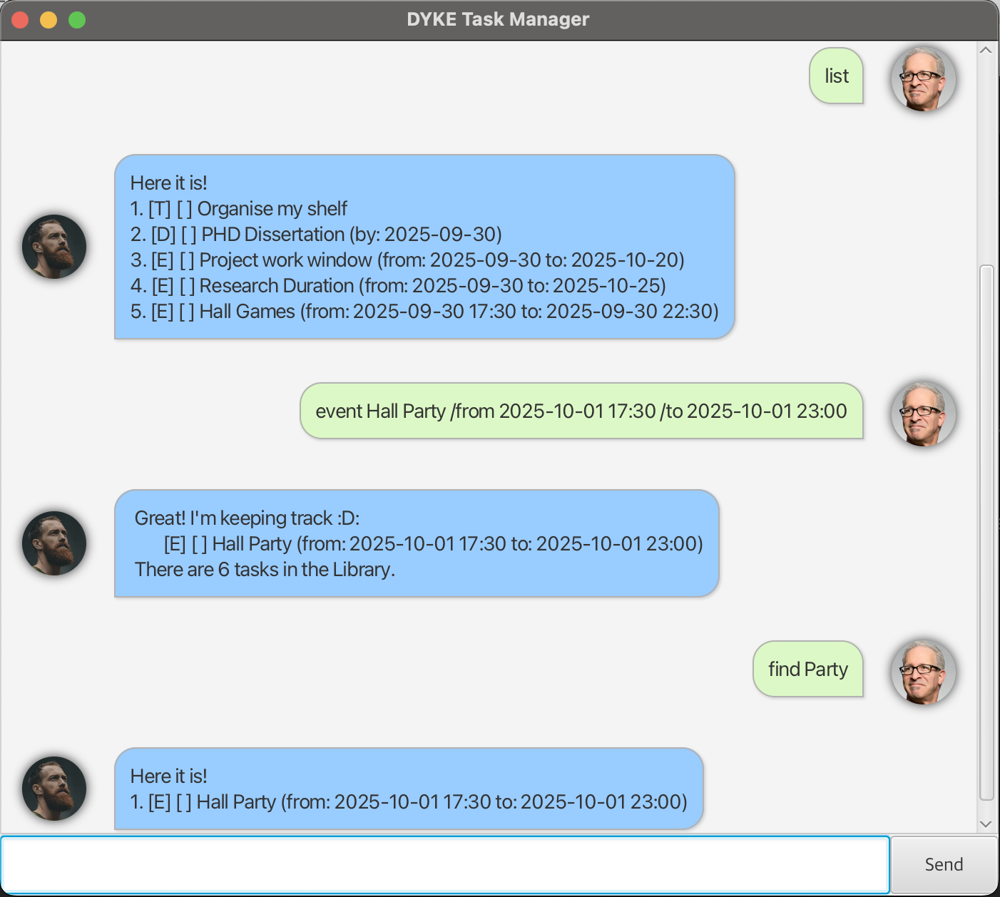

# Dyke User Guide

## Product Interface


**Dyke** is your new favourite Task managing chatbot! It helps you to organise and find your tasks efficiently! 
It almost feels like an **Ai assistant** ready at your call! (~ although he can be a little *sassy*...) Just type away, and he's ready to help you
**Conquer the day!**

## Adding deadlines
To add a deadline, type in "deadline" followed by the activity, then type "/by" followed by
the date and optionally, time when it will be completed.

Example: `deadline PHD Dissertation /by 2025-09-30`

```
Great! I'm keeping track :D:
    [D][ ] PHD Dissertation (by: 2025-09-30)
There is 1 task in the Library.
```

## Adding Todo

Todo functions similarly to Deadline but uses "todo" at the start followed by just the activity. No dates or times!

Example: `todo PHD Dissertation`

```
Great! I'm keeping track :D:
    [T][ ] PHD Dissertation
There is 1 task in the Library.
```

## Finding tasks

`Find` helps you find your tasks quickly and efficiently! Simply type "find" followed by the keyword.

Example: `find Party`

```
Here it is!
1. [E][ ] Hall Party (from: 2025-10-01 17:30 to: 2025-10-01 23:00)
```

## Other Features

You can check out the other features of this app by using "help"!

Example: `help`

```
Here are the commands I \actually\ understand...
...
```

## Go and conquer the day!! 
